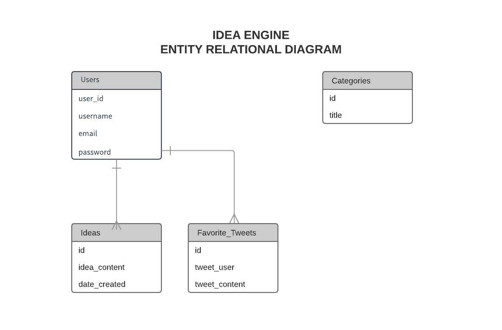

# Dabro-IdeaEngine
General Assembly WDI NYC - Project 3. Darren, Gaby and Aemiro

>**IGENIO**, Ideas Egine is a platform that allows users to find and generate ideas. The app will englobe popular topics and current events; ranging from tech, fashion, travel, business, food, etc.

## Technologies Used
Technologies | Description
--- | ---
HTML | Structure of the application layout
CSS | Styling/Design of application
Javascript | Browser scripting language
Heroku | Application Hosting platform
React.js | Client library to help building user-interfaces
Node.js | Javascript based server
Express.js | Node.js framework to help building web servers
Passport.kjs | An authentication framework for Node.js
Postgres | Database for store application data
Twitter API | API for retrieving random ideas

## General Approach
>After wireframing our application and deciding on the technologies we will utilized, we created a plan based on what each team member wanted to work on. Then we set deadlines by which they should be completed. We each created a branch to work on our assigned tasks with the aim of merging all of them once completed. We also set a rule that two members should not be working on the same files simultaneously to avoid stepping on each others toes. 

>We completed the backend first as it is the skeleton of our application. We also ensured that this task was assigned to only one member to facilitate the process. A second team member worked on authentification, a third one worked on the React components. As the React components became challenging to manage we as a team contributed to debugging and figuring out how to make things work. As the tasks took more time than anticipated to complete we expanded our deadlines and focus on the necessary deliverables. 

>To conclude, after working on our branches and having working components we merge our different branches. We worked on debugging issues and ensured that the application was >working on its entirety. Lastly, one member worked on styling and design. 

#### Installation instructions for any dependencies
To install, you first need to have: 
1. A Postgres database running.
2. The nodemon npm package installed globally, if not, include it globally using:
`npm -i nodemon -g`
 
To install project, follow the instructions below:
>In the terminal, fork or clone down this repository onto your computer.
Run `npm run setup` inside the root directory of the project.
Then, run `npm start` and the server will be running at **localhost:3001**.

To run the React app seprately, change directory into `client/src` and run `npm run start`

## Database Structure ERD
We created a database that has 2 tables: users and ideas. The user table stores the user’s information such as email address, username and password. The ideas table stores the text content of the user’s input and an user id to identify which idea belongs to which user.

## User Stories 
>We expect our users to be mainly individuals who are looking for new ideas or having a hard time organizing their ideas. And so we expect our users to expect to be the following:

- As a user looking for inspiration, I can get a random idea to inspire me.
- As a user who wants to save my ideas for a later date, I can register with the app and login and view my ideas from any internet enabled device.
- As a busy user who needs to store information somewhere, I can create, edit, view or delete ideas that are only available to me.

## Wire Frames

## Wins
>We were able to deliver a functional MVP that met the expectations of our initial MVP concept. Taking time into consideration, the most important API requirements were completed. That includes: getting a random tweet from the Twitter API and allowing users to CRUD their own ideas.

## Challenges
>As React abstracts away all direct interactions with the DOM, React was the only way to handle the laying out of different parts of the app. We found in particular, routing views of components within each other to be very complex.

>Styling React components was also an issue due to different parts of the page being broken up into several components. This made debugging and styling more cumbersome than without using Javascript.

>Deploying to Heroku also challenged us due to the complexity around deploying a React application running on Node.js, backed by a Postgres database, that makes API calls to Twitter API.

